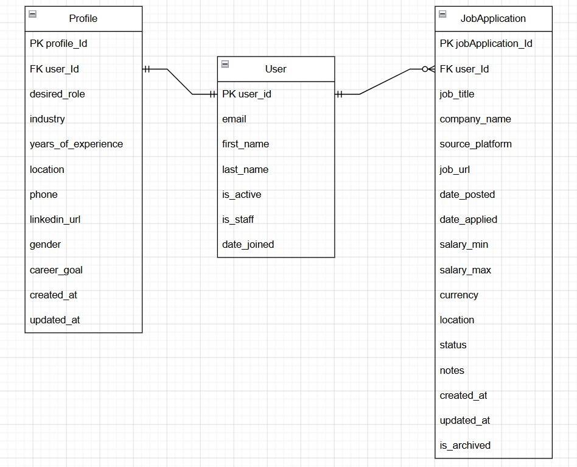
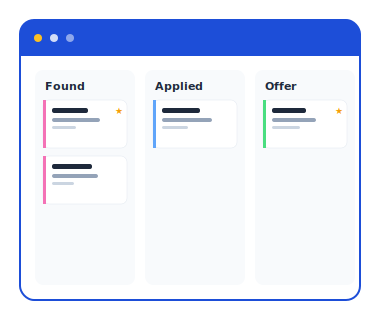
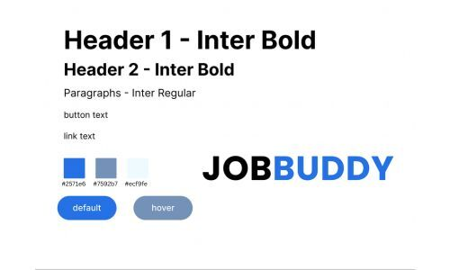

# JOBBUDDY
> programmer-penguins

## Mission Statement

JOBBUDDY is an online portal designed to support junior job candidates and career switchers throughout the job application process. It provides a centralised space where users can organise and track their applications, helping bring more structure and clarity to what can often feel like a stressful, fragmented and overwhelming experience.

The platform aims to combine practical tools for managing applications with features that make the job seeking process structured and organised rather than segmented. It also includes a  motivational aspect for when the user is feeling demotivated during the job search process. By having one central repository where all aspects of each application can be stored, JOBBUDDY helps users stay organised, focused, and supported as they work towards their career goals.

## Features

### Authentication & User Management
- User registration with email and password
- Secure login and logout functionality
- Google authentication support (OAuth)
- Each user has a personal account with isolated data

### User Profile
Create and update personal profile information
Fields include:
  - Desired role
  - Industry
  - Years of experience
  - Location
  - Phone number
  - LinkedIn profile
  - Gender (with self-describe option)
- Career goals
- Profile can be edited at any time

### Job Application Tracking
Create, edit, and delete job applications
Store detailed information for each application:
  - Job title
  - Company name
  - Source platform (LinkedIn, Seek, Indeed, Other)
  - Custom source details (if “Other” selected)
  - Job URL
  - Application and posting dates
  - Salary range and currency
  - Location
  - Notes

### Kanban Board
Visual tracking of job applications using a Kanban-style board
Applications are grouped by status:
  - Found
  - Applied
  - Interviewing
  - Offer
  - Rejected
  - Withdrawn
Quick overview of application progress
Ability to create new applications directly from each column

### Filtering & Organisation
Filter applications by:
  - Status
  - Source Platform
  - Active/Inactive state
Sort applications by most recent activity

### Flexible Data Structure
Clean separation between user data, profile, and job applications
Scalable backend architecture to support future features such as:
  - Automated job data import
  - Analytics and reporting
Integration with external job platforms

### Future Enhancements (Planned)

  - AI-powered motivational chatbot
  - Resources page with job search materials
  - Automatic data import from platforms like LinkedIn and Seek
  - Company logo integration
  - Enhanced analytics dashboard

### Summary 
Provide users with a motivational, streamlined, stress-free tracking and storage portal for all aspects of the job search/application process to help reduce the most overwhelming and frustrating aspect of a user's job search journey

## Technical Implementation

### Back-End

- Django / DRF API
- Python

### Front-End

- React / JavaScript
- HTML/CSS

### Git & Deployment
- Heroku
- Netlify
- GitHub

This application's back-end will be deployed to Heroku. The front-end will be deployed separately to Netlify.
 
We will also use Insomnia to ensure API endpoints are working smoothly (we will utilise a local and deployed environment in Insomnia).

## Target Audience
This platform has two primary target audiences: job seekers who are junior candidates and career switchers.

Job seekers will use this platform to track and manage their job applications in one central place. They can record applications from different platforms (such as LinkedIn, Seek, Indeed), monitor their progress through various stages, and keep notes related to each opportunity.

This platform is designed for job seekers to simplify a typically fragmented and overwhelming process, while also supporting the emotional aspect of a job-seeking journey.

## Back-end Implementation
### API Specification

| HTTP Method | URL                       | Purpose                                     | Request Body                                                          |
| ----------- | ------------------------- | ------------------------------------------- | --------------------------------------------------------------------- |
| POST        | `/api/auth/login/`        | Allow users to log in                       | `{ "email": "string", "password": "string" }`                         |
| POST        | `/api/auth/logout/`       | Allow users to log out (end active session) | N/A                                                                   |
| POST        | `/api/auth/registration/` | Create a new user account                   | `{ "email": "string", "password1": "string", "password2": "string" }` |
| GET         | `/api/auth/user/`         | Retrieve current authenticated user         | N/A                                                                   |

### Profile

| HTTP Method | URL                             | Purpose                       | Request Body                                                                                       |
| ----------- | ------------------------------- | ----------------------------- | -------------------------------------------------------------------------------------------------- |
| GET         | `/api/profile/me/`              | View current user account and profile details     | N/A                                                                                                |
| PATCH         | `/api/profile/me/`              | Update current user account and profile details     | `{ "username": "string", "email": "string", "first_name": "string", "last_name": "string", "desired_role": "string", "industry": "string", "location": "string", "phone": "string", ... }` |
| DELETE      | `/api/profile/me/` | Deactivate current user account (soft delete)           | N/A                                                                                                |

### Job Applications

| HTTP Method | URL                       | Purpose                                   | Request Body                                                                                                        |
| ----------- | ------------------------- | ----------------------------------------- | ------------------------------------------------------------------------------------------------------------------- |
| GET         | `/api/applications/`      | Get all job applications for current user | N/A                                                                                                                 |
| POST        | `/api/applications/`      | Create a new job application              | `{ "job_title": "string", "company_name": "string", "source_platform": "string", "source_details": "string", ... }` |
| GET         | `/api/applications/<id>/` | Retrieve a specific job application       | N/A                                                                                                                 |
| PATCH       | `/api/applications/<id>/` | Partially update job application          | `{ "status": "string", "notes": "string", ... }`                                                                    |
| PUT         | `/api/applications/<id>/` | Fully update job application              | `{ "job_title": "string", "company_name": "string", ... }`                                                          |
| DELETE      | `/api/applications/<id>/` | Delete job application                    | N/A                                                                                                                 |

### Kanban View

| HTTP Method | URL                         | Purpose                                                           | Request Body |
| ----------- | --------------------------- | ----------------------------------------------------------------- | ------------ |
| GET         | `/api/applications/kanban/` | Get all applications for kanban board (frontend groups by status) | N/A          |

### Filtering (Query Parameters)

| Method | URL                                           | Purpose                    | Example                                       |
| ------ | --------------------------------------------- | -------------------------- | --------------------------------------------- |
| GET    | `/api/applications/?status=APPLIED`           | Filter by status           | `/api/applications/?status=APPLIED`           |
| GET    | `/api/applications/?source_platform=LINKEDIN` | Filter by source           | `/api/applications/?source_platform=LINKEDIN` |
| GET    | `/api/applications/?is_active=true`           | Filter active applications | `/api/applications/?is_active=true`           |   

### Admin User Management
| Method | Endpoint                    | Description                      |
| ------ | --------------------------- | -------------------------------- |
| GET    | `/api/profile/admin/users/` | Retrieve all users with profiles |
| GET    | `/api/profile/admin/users/<id>/` | Retrieve specific user  |
| PATCH  | `/api/profile/admin/users/<id>/` | Update user and profile |
| PATCH  | `/api/profile/admin/users/<id>/deactivate/` | Deactivate user account |
| PATCH  | `/api/profile/admin/users/<id>/restore/` | Restore previously deactivated user |

### Object Definitions

#### Users
| Field        | Data type |
| ------------ | --------- |
| user_id (PK) | integer   |
| email        | string    |
| first_name   | string    |
| last_name    | string    |
| is_active    | boolean   |
| is_staff     | boolean   |
| date_joined  | datetime  |

#### Profile

| Field               | Data type |
| ------------------- | --------- |
| profile_id (PK)     | integer   |
| user_id (FK)        | integer   |
| desired_role        | string    |
| industry            | string    |
| years_of_experience | integer   |
| location            | string    |
| phone               | string    |
| linkedin_url        | string    |
| gender              | string    |
| career_goal         | string    |
| created_at          | datetime  |
| updated_at          | datetime  |

#### JobApplication

| Field                  | Data type |
| ---------------------- | --------- |
| jobApplication_id (PK) | integer   |
| user_id (FK)           | integer   |
| job_title              | string    |
| company_name           | string    |
| source_platform        | string    |
| job_url                | string    |
| date_posted            | date      |
| date_applied           | date      |
| salary_min             | decimal   |
| salary_max             | decimal   |
| currency               | string    |
| location               | string    |
| status                 | string    |
| notes                  | text      |
| created_at             | datetime  |
| updated_at             | datetime  |
| is_active              | boolean   |

### Database Schema

## Front-end Implementation

### Wireframes

See all wireframes and how users would see the JOBBUDDY website: https://www.figma.com/proto/KJ9w5Uzrb1T9WyJHEI1Are/Job-Buddy?node-id=1-6&p=f&t=Vl4M[…]OiPjBQ8-1&scaling=min-zoom&content-scaling=fixed&page-id=0%3A1

#### Home Page

#### Collection List Page

### Logo

### Colours & Font

