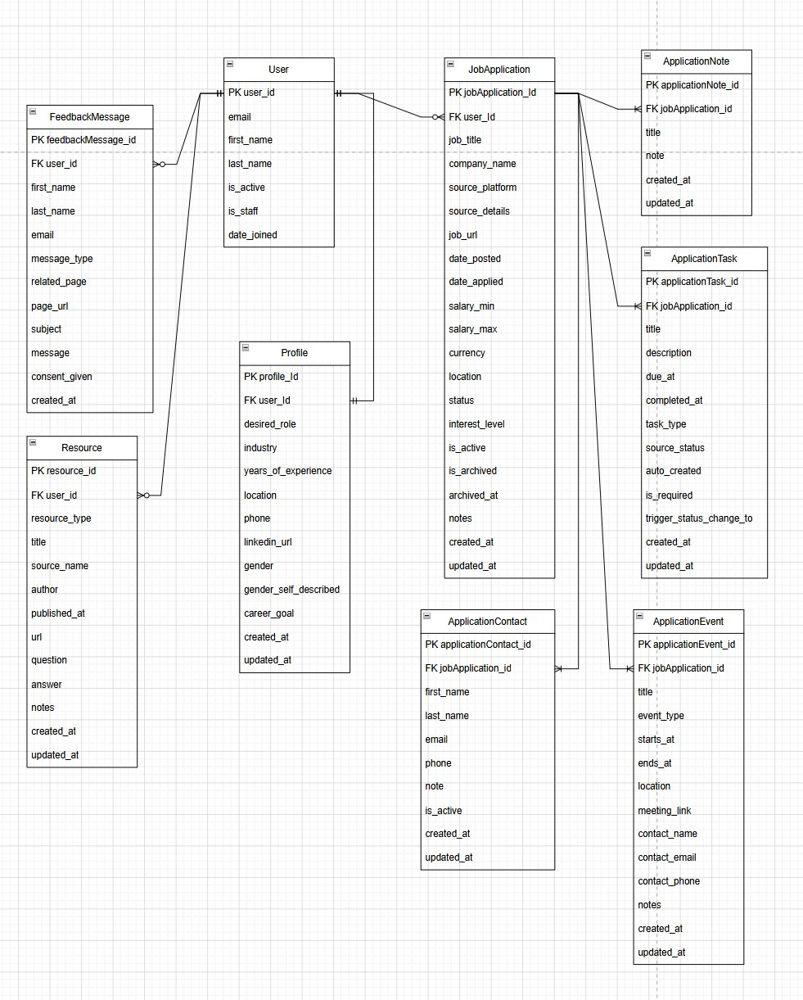
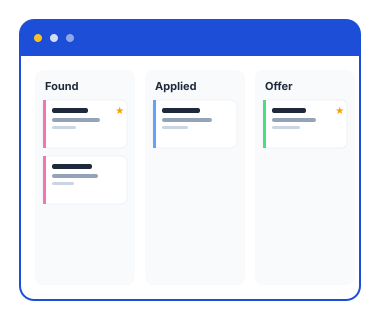
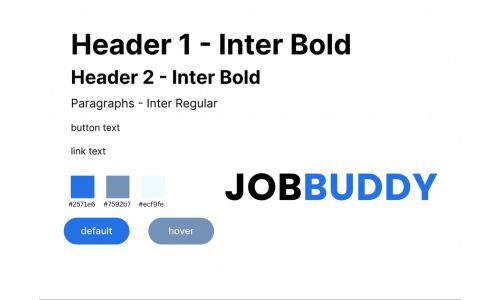

# JobTracker
> programmer-penguins

## Mission Statement

JobTracker is an online portal designed to support junior job candidates and career switchers throughout the job application process. It provides a centralised space where users can organise and track their applications, helping bring more structure and clarity to what can often feel like a stressful, fragmented and overwhelming experience.

The platform aims to combine practical tools for managing applications with features that make the job seeking process structured and organised rather than segmented. It also includes a  motivational aspect for when the user is feeling demotivated during the job search process. By having one central repository where all aspects of each application can be stored, JobTracker helps users stay organised, focused, and supported as they work towards their career goals.

## Features

### Authentication & User Management
- User registration with email and password
- Secure login and logout functionality
- Google authentication support (OAuth)
- Each user has a personal account with isolated data

### User Profile
Create and update personal profile information
Fields include:
  - Desired role
  - Industry
  - Years of experience
  - Location
  - Phone number
  - LinkedIn profile
  - Gender (with self-describe option)
- Career goals
- Profile can be edited at any time

### Job Application Tracking
Create, edit, and delete job applications
Store detailed information for each application:
  - Job title
  - Company name
  - Source platform (LinkedIn, Seek, Indeed, Other)
  - Custom source details (if “Other” selected)
  - Job URL
  - Application and posting dates
  - Salary range and currency
  - Location
  - Notes

### Kanban Board
Visual tracking of job applications using a Kanban-style board
Applications are grouped by status:
  - Found
  - Applied
  - Interviewing
  - Offer
  - Rejected
  - Withdrawn
Quick overview of application progress
Ability to create new applications directly from each column

### Filtering & Organisation
Filter applications by:
  - Status
  - Source Platform
  - Active/Inactive state
Sort applications by most recent activity

### Flexible Data Structure
Clean separation between user data, profile, and job applications
Scalable backend architecture to support future features such as:
  - Automated job data import
  - Analytics and reporting
Integration with external job platforms

### Future Enhancements (Planned)

  - AI-powered motivational chatbot
  - Resources page with job search materials
  - Automatic data import from platforms like LinkedIn and Seek
  - Company logo integration
  - Enhanced analytics dashboard

### Summary 
Provide users with a motivational, streamlined, stress-free tracking and storage portal for all aspects of the job search/application process to help reduce the most overwhelming and frustrating aspect of a user's job search journey

## Technical Implementation

### Back-End

- Django / DRF API
- Python
- PostgreSQL (production) / SQLite (development)
- Authentication: Django Allauth (Google OAuth)
- Admin interface: Django Admin

### Front-End

- React / JavaScript
- HTML/CSS

### Git & Deployment
- Heroku
- Netlify
- GitHub

This application's back-end will be deployed to Heroku. The front-end will be deployed separately to Netlify.
 
We will also use Insomnia to ensure API endpoints are working smoothly (we will utilise a local and deployed environment in Insomnia).

## Target Audience
This platform has two primary target audiences: job seekers who are junior candidates and career switchers.

Job seekers will use this platform to track and manage their job applications in one central place. They can record applications from different platforms (such as LinkedIn, Seek, Indeed), monitor their progress through various stages, and keep notes related to each opportunity.

This platform is designed for job seekers to simplify a typically fragmented and overwhelming process, while also supporting the emotional aspect of a job-seeking journey.

## Back-end Implementation
### API Specification

| HTTP Method | URL                       | Purpose                                     | Request Body                                                          |
| ----------- | ------------------------- | ------------------------------------------- | --------------------------------------------------------------------- |
| POST        | `/api/auth/login/`        | Allow users to log in                       | `{ "email": "string", "password": "string" }`                         |
| POST        | `/api/auth/logout/`       | Allow users to log out (end active session) | N/A                                                                   |
| POST        | `/api/auth/registration/` | Create a new user account                   | `{ "email": "string", "password1": "string", "password2": "string" }` |
| GET         | `/api/auth/user/`         | Retrieve current authenticated user         | N/A                                                                   |
| POST        | `/api/auth/google/`       | Google OAuth login                          | `{ "access_token": "string" }`                                        |
| POST        | `/api/auth/password-reset/` | Request password reset                   | `{ "email": "string" }`                                                |
| POST        | `/api/auth/password-reset-confirm/` | Confirm password reset             | `{ "uid": "string", "token": "string", "new_password1": "string", "new_password2": "string" }` |

### Profile

| HTTP Method | URL                             | Purpose                       | Request Body                                                                                       |
| ----------- | ------------------------------- | ----------------------------- | -------------------------------------------------------------------------------------------------- |
| GET         | `/api/profile/me/`              | View current user account and profile details     | N/A                                                                                                |
| PATCH       | `/api/profile/me/`              | Update current user account and profile details     | `{ "username": "string", "email": "string", "first_name": "string", "last_name": "string", "desired_role": "string", "industry": "string", "location": "string", "phone": "string", ... }` |
| DELETE      | `/api/profile/me/`              | Deactivate current user account (soft delete)           | N/A                                                                                                |

### Admin User Management

| HTTP Method | URL                                  | Purpose                                   | Request Body |
| ----------- | ------------------------------------ | ----------------------------------------- | ------------ |
| GET         | `/api/profile/admin/users/`          | Retrieve all users with profiles          | N/A          |
| GET         | `/api/profile/admin/users/<id>/`     | Retrieve a specific user and profile      | N/A          |
| PATCH       | `/api/profile/admin/users/<id>/`     | Update user and profile details           | `{ "username": "string", "email": "string", ... }` |
| PATCH       | `/api/profile/admin/users/<id>/deactivate/` | Deactivate user account             | N/A          |
| PATCH       | `/api/profile/admin/users/<id>/restore/` | Restore previously deactivated user account | N/A          |

### Job Applications

| HTTP Method | URL | Purpose | Request Body |
| ----------- | --- | ------- | ------------ |
| GET | `/api/applications/` | Get all job applications for the current user | N/A |
| POST | `/api/applications/` | Create a new job application | `{ "job_title": "string", "company_name": "string", "source_platform": "string", "source_details": "string", ... }` |
| GET | `/api/applications/<id>/` | Retrieve a specific job application owned by the current user | N/A |
| PATCH | `/api/applications/<id>/` | Partially update a job application owned by the current user | `{ "status": "string", "notes": "string", ... }` |
| DELETE | `/api/applications/<id>/` | Deactivate a job application owned by the current user (soft delete) | N/A |
| GET | `/api/applications/archived/` | Get archived applications for the current user | N/A |
| GET | `/api/applications/deleted/` | Get deleted applications for the current user | N/A |
| PATCH | `/api/applications/<id>/archive/` | Archive a job application | N/A |
| PATCH | `/api/applications/<id>/restore/` | Restore a job application | N/A |
| POST | `/api/applications/extract/` | Extract job details from URL | `{ "url": "string" }` |

### Contacts within Job Application

| HTTP Method | URL | Purpose | Request Body |
| ----------- | --- | ------- | ------------ |
| GET | `/api/applications/<job_id>/contacts/` | Get all active contacts for a specific job application owned by the current user | N/A |
| POST | `/api/applications/<job_id>/contacts/` | Create a new contact for a specific job application | `{ "first_name": "string", "last_name": "string", "email": "string", "phone": "string", "note": "string" }` |

### Individual Contact Management

| HTTP Method | URL | Purpose | Request Body |
| ----------- | --- | ------- | ------------ |
| GET | `/api/applications/contacts/<id>/` | Retrieve a specific contact owned by the current user | N/A |
| PATCH | `/api/applications/contacts/<id>/` | Partially update a contact owned by the current user | `{ "first_name": "string", "last_name": "string", "email": "string", "phone": "string", "note": "string" }` |
| DELETE | `/api/applications/contacts/<id>/` | Deactivate a contact owned by the current user (soft delete) | N/A |
| PATCH | `/api/applications/contacts/<id>/restore/` | Restore a previously deactivated contact owned by the current user | N/A |

### Application Notes

| HTTP Method | URL | Purpose | Request Body |
| ----------- | --- | ------- | ------------ |
| GET | `/api/applications/<job_id>/notes/` | Get all notes for a specific job application | N/A |
| POST | `/api/applications/<job_id>/notes/` | Create a new note for a specific job application | `{ "title": "string", "note": "string" }` |
| GET | `/api/applications/notes/<id>/` | Retrieve a specific note | N/A |
| PATCH | `/api/applications/notes/<id>/` | Partially update a note | `{ "title": "string", "note": "string" }` |
| DELETE | `/api/applications/notes/<id>/` | Delete a note | N/A |

### Application Tasks

| HTTP Method | URL | Purpose | Request Body |
| ----------- | --- | ------- | ------------ |
| GET | `/api/applications/tasks/` | Get all tasks for the current user | N/A |
| POST | `/api/applications/tasks/` | Create a new task | `{ "job_application": int, "title": "string", "description": "string", ... }` |
| GET | `/api/applications/tasks/<id>/` | Retrieve a specific task | N/A |
| PATCH | `/api/applications/tasks/<id>/` | Partially update a task | `{ "title": "string", "description": "string", ... }` |
| DELETE | `/api/applications/tasks/<id>/` | Delete a task | N/A |
| PATCH | `/api/applications/tasks/<id>/complete/` | Mark task as completed | N/A |
| PATCH | `/api/applications/tasks/<id>/reopen/` | Reopen a completed task | N/A |

### Application Events

| HTTP Method | URL | Purpose | Request Body |
| ----------- | --- | ------- | ------------ |
| GET | `/api/applications/events/` | Get all events for the current user | N/A |
| POST | `/api/applications/events/` | Create a new event | `{ "job_application": int, "title": "string", "event_type": "string", "starts_at": "datetime", ... }` |
| GET | `/api/applications/events/<id>/` | Retrieve a specific event | N/A |
| PATCH | `/api/applications/events/<id>/` | Partially update an event | `{ "title": "string", "starts_at": "datetime", ... }` |
| DELETE | `/api/applications/events/<id>/` | Delete an event | N/A |

### Kanban View

| HTTP Method | URL | Purpose | Request Body |
| ----------- | --- | ------- | ------------ |
| GET | `/api/applications/kanban/` | Get active applications for the current user's Kanban board | N/A |

### Filtering (Query Parameters)

| Method | URL | Purpose | Example |
| ------ | --- | ------- | ------- |
| GET | `/api/applications/?status=APPLIED` | Filter by status | `/api/applications/?status=APPLIED` |
| GET | `/api/applications/?source_platform=LINKEDIN` | Filter by source platform | `/api/applications/?source_platform=LINKEDIN` |
| GET | `/api/applications/?is_active=true` | Filter active applications | `/api/applications/?is_active=true` |
| GET | `/api/applications/?is_active=false` | Filter inactive/deactivated applications | `/api/applications/?is_active=false` |
| GET | `/api/applications/?is_archived=false` | Filter non-archived applications | `/api/applications/?is_archived=false` |
| GET | `/api/applications/?interest_level=5` | Filter by interest level (1-10) | `/api/applications/?interest_level=5` |
| GET | `/api/applications/?search=developer` | Search in job title and company | `/api/applications/?search=developer` |

### Admin Job Application Management

| Method | Endpoint | Description |
| ------ | -------- | ----------- |
| GET | `/api/applications/admin/` | Retrieve all job applications from all users |
| GET | `/api/applications/admin/<id>/` | Retrieve a specific job application |
| PATCH | `/api/applications/admin/<id>/` | Update any job application |
| DELETE | `/api/applications/admin/<id>/` | Deactivate any job application (soft delete) |
| PATCH | `/api/applications/admin/<id>/restore/` | Restore previously deactivated job application |

### Admin Contact Management

| HTTP Method | URL | Purpose | Request Body |
| ----------- | --- | ------- | ------------ |
| GET | `/api/applications/admin/contacts/` | Retrieve all contacts from all job applications | N/A |
| GET | `/api/applications/admin/contacts/?is_active=true` | Retrieve all active contacts from all job applications | N/A |
| GET | `/api/applications/admin/contacts/?is_active=false` | Retrieve all deactivated contacts from all job applications | N/A |
| GET | `/api/applications/admin/<job_id>/contacts/` | Retrieve all contacts for a specific job application | N/A |
| GET | `/api/applications/admin/<job_id>/contacts/?is_active=true` | Retrieve active contacts for a specific job application | N/A |
| GET | `/api/applications/admin/<job_id>/contacts/?is_active=false` | Retrieve deactivated contacts for a specific job application | N/A |
| GET | `/api/applications/admin/contacts/<id>/` | Retrieve a specific contact | N/A |
| PATCH | `/api/applications/admin/contacts/<id>/` | Partially update any contact | `{ "first_name": "string", "last_name": "string", "email": "string", "phone": "string", "note": "string", "is_active": true }` |
| DELETE | `/api/applications/admin/contacts/<id>/` | Deactivate any contact (soft delete) | N/A |
| PATCH | `/api/applications/admin/contacts/<id>/restore/` | Restore a previously deactivated contact | N/A |

### Object Definitions

#### Users
| Field        | Data type |
| ------------ | --------- |
| user_id (PK) | integer   |
| email        | string    |
| first_name   | string    |
| last_name    | string    |
| is_active    | boolean   |
| is_staff     | boolean   |
| date_joined  | datetime  |

#### Profile

| Field                   | Data type |
|------------------------|----------|
| profile_id (PK)        | integer  |
| user_id (FK)           | integer  |
| desired_role           | string   |
| industry               | string   |
| years_of_experience    | integer  |
| location               | string   |
| phone                  | string   |
| linkedin_url           | string   |
| gender | enum (female, male, non_binary, prefer_not_to_say, self_describe) |
| gender_self_described  | string   |
| career_goal            | text     |
| created_at             | datetime |
| updated_at             | datetime |

#### JobApplication

| Field                  | Data type |
| ---------------------- | --------- |
| jobApplication_id (PK) | integer   |
| user_id (FK)           | integer   |
| job_title              | string    |
| company_name           | string    |
| source_platform        | enum (SEEK, LINKEDIN, INDEED, OTHER) |
| source_details         | string    |
| job_url                | string    |
| date_posted            | date      |
| date_applied           | date      |
| salary_min             | decimal   |
| salary_max             | decimal   |
| currency               | string    |
| location               | string    |
| status                 | enum (FOUND, APPLIED, INTERVIEWING, OFFER, REJECTED, WITHDRAWN) |
| interest_level         | integer   |
| is_active              | boolean   |
| is_archived            | boolean   |
| archived_at            | datetime  |
| created_at             | datetime  |
| updated_at             | datetime  |

#### ApplicationContact

| Field                  | Data type |
| ---------------------- | --------- |
| applicationContact_id (PK) | integer |
| jobApplication_id (FK) | integer |
| first_name             | string    |
| last_name              | string    |
| email                  | string    |
| phone                  | string    |
| note                   | text      |
| is_active              | boolean   |
| created_at             | datetime  |
| updated_at             | datetime  |

#### ApplicationNote

| Field                  | Data type |
| ---------------------- | --------- |
| applicationNote_id (PK)| integer   |
| jobApplication_id (FK) | integer   |
| title                  | string    |
| note                   | text      |
| created_at             | datetime  |
| updated_at             | datetime  |

#### ApplicationTask

| Field                  | Data type |
| ---------------------- | --------- |
| applicationTask_id (PK)| integer   |
| jobApplication_id (FK) | integer   |
| title                  | string    |
| description            | text      |
| due_at                 | datetime  |
| completed_at           | datetime  |
| task_type              | enum (TAILOR_RESUME, COVER_LETTER, SUBMIT_APPLICATION, FOLLOW_UP, INTERVIEW_PREP, INTERVIEW_FOLLOW_UP, REJECTION_FEEDBACK, OFFER_REVIEW, CUSTOM) |
| source_status          | enum (FOUND, APPLIED, INTERVIEWING, OFFER, REJECTED, WITHDRAWN) |
| auto_created           | boolean   |
| is_required            | boolean   |
| triggers_status_change_to | enum (FOUND, APPLIED, INTERVIEWING, OFFER, REJECTED, WITHDRAWN) |
| created_at             | datetime  |
| updated_at             | datetime  |

#### ApplicationEvent

| Field                  | Data type |
| ---------------------- | --------- |
| applicationEvent_id (PK)| integer  |
| jobApplication_id (FK) | integer   |
| title                  | string    |
| event_type             | enum (INTERVIEW, CALL, DEADLINE, OTHER) |
| starts_at              | datetime  |
| ends_at                | datetime  |
| location               | string    |
| meeting_link           | string    |
| contact_name           | string    |
| contact_email          | string    |
| contact_phone          | string    |
| notes                  | text      |
| created_at             | datetime  |
| updated_at             | datetime  |

### Database Schema

## Front-end Implementation

### Wireframes

See all wireframes and how users would see the JobTracker website: https://www.figma.com/proto/KJ9w5Uzrb1T9WyJHEI1Are/Job-Buddy?node-id=1-6&p=f&t=Vl4M[…]OiPjBQ8-1&scaling=min-zoom&content-scaling=fixed&page-id=0%3A1

#### Home Page

#### Collection List Page

### Logo

### Colours & Font

